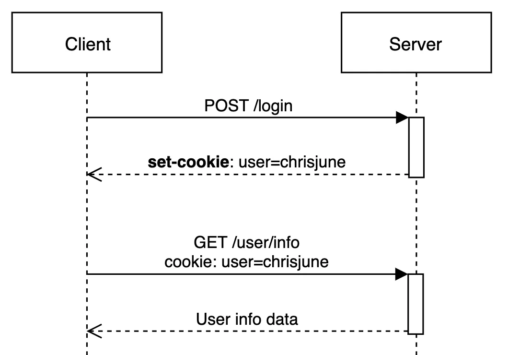
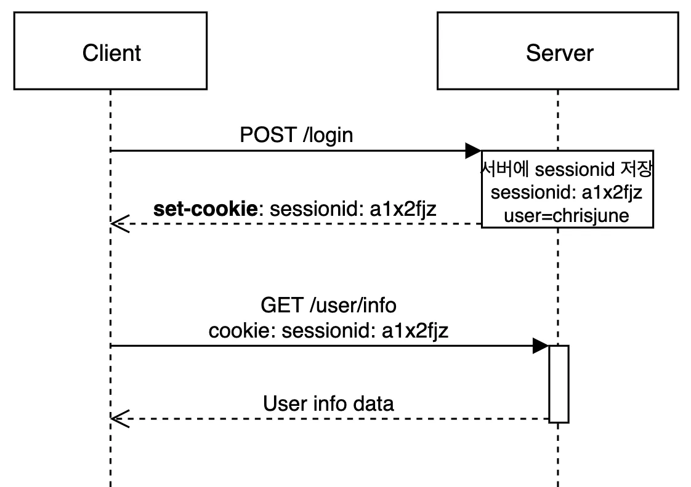

# 11. 쿠키와 세션은 무슨 차이인가?

## 0. 쿠키와 세션의 필요성
    "HTTP의 특징의 약점을 보완하기 위해"
HTTP는 1. **Connectionless**, 2. **Stateless** 두 가지 특징을 가짐

- **Connectionless (비연결성)**
  - 서버는 request에 대한 response를 처리한 후 연결을 끊음
- **Stateless (무상태성)**
  - 서버가 이전의 request, response을 기억하지 않음
  - 즉, 각 request는 독립적임

하지만, 실제 상황에서는 상태를 유지해야 하는 경우가 많음  
예를 들어, 로그인 정보가 유지되지 않아, 페이지 이동마다 로그인을 해야한다면 얼마나 불편할까?  
--> 이러한 HTTP의 약점을 **쿠키와 세션** 사용하여 해결

cf. 그렇다면, 해당 특징의 장점은?  
- connectionless: 서버의 효율적 리소스 사용 (연결을 지속할 필요가 없기 때문에, 많은 수의 클라이언트와 동시 연결을 처리할 수 있음)
- stateless: 서버 리소스 절약 (서버가 상태 정보를 저장하지 않기 때문에, 메모리 절약 가능)

## 1. 쿠키란?
    웹사이트가 사용자의 웹 브라우저에 저장하는 작은 데이터 조각

### 동작 순서

### 특징
- key - value 형태의 데이터 (이름, 값, 유효시간, 도메인, 경로)
- 클라이언트 로컬 (웹 브라우저)에 저장됨
- 브라우저가 종료되어도 유지됨
- 자동 로그인(방문 사이트에서의 아이디/비밀번호 저장), 장바구니 등에 쓰임

### 한계
**CSRF(Cross-Site Request Forgery) 문제**

    공격자가 사용자의 브라우저를 이용해, 사용자가 의도하지 않은 액션을 서버에 요청하게 하는 공격 방법
- 쿠키의 자동 전송 특성을 악용한 공격 
- 사용자가 방문할 수 있는 웹페이지에 악의적인 링크나 버튼 배치

**해결책**
- referer check
  - HTTP request header에서 referer 정보 확인 가능
  - 일반적으로 host와 referer 값이 일치함.
  - referer check만으로도 많은 공격을 방어할 수 있음

## 2. 세션이란?
    웹 사이트의 여러 페이지에 걸쳐 사용되는 사용자 정보를 저장하는 방법
    = 일정 시간 동안 같은 브라우저로부터 들어오는 일련의 요구를 하나의 상태로 보고 그 상태를 유지하는 기술

### 동작 순서

### 특징
- 웹 서버에 저장되는 쿠키 (= 세션 쿠키)
- 브라우저를 종료하면 삭제되므로 쿠키보다 보안 우세
- 각 클라이언트에게 고유 sessionId 부여
- 사용자 인증 (로그인 유지) 등에 쓰임 

### 한계
**인증 측면에서의 한계**  
session-id를 쿠키에 담아 인증을 시도하는 경우가 많음.  
하지만 트래픽 증가에 따라 단일 서버로는 운용이 어려워, scale-out하게 됨.  
여기서 **1. 모든 서버에 동기화할 때의 어려움** 발생  
또한, **2. 요청마다 session을 확인하는 데에 따른 상당한 부하**  

**해결책**  
세션의 단점을 보완하고자, `토큰` 방식 등장

## 3. 쿠키와 세션의 가장 큰 차이
    쿠키는 클라이언트 측에, 세션은 서버 측에 저장  

**이 밖의 차이점**
- 세션은 서버에 저장되기 때문에, 쿠키보다 안전
- 세션은 브라우저가 종료되면 사라지는 반면, 쿠키는 설정된 기간동안 유효

## 4. 캐시란?
**쿠키**: 정보 저장에 쓰임  
**캐시**: 웹 페이지 요소 저장에 쓰임. 즉, 이미지, 비디오, 오디오, css, js파일 등 데이터나 값을 미리 복사해 놓는 리소스 파일들의 임시 저장소

 

### 참고자료
- https://dev-coco.tistory.com/61
- https://jjongins.tistory.com/25
- https://chrisjune-13837.medium.com/web-%EC%BF%A0%ED%82%A4-%EC%84%B8%EC%85%98%EC%9D%B4%EB%9E%80-aa6bcb327582
- https://www.youtube.com/watch?v=cWUtMHTKdj0
- https://devscb.tistory.com/123