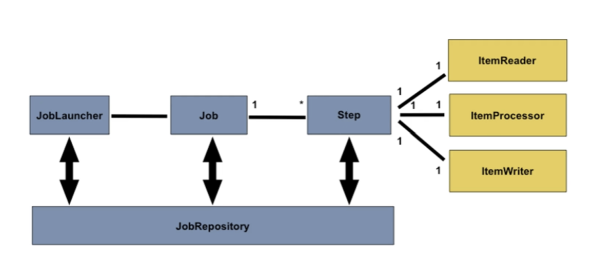

# 1. Batch란?

- 데이터를 일괄적으로 모아서 **한 번에 처리**하는 작업 **(↔ 실시간 작업)**
- **대량의 데이터**를 효율적으로 처리하고 관리해야 하는 상황에 사용됨
    - 대규모 DB 업데이트, 대용량 파일 처리, 빅데이터 분석 등 대량의 데이터 처리
    - 정기적 데이터 동기화
    - 카드사 → 가맹점 정산
    - 이메일 쿠폰 발송
- 데이터를 읽고, 가공하고, 쓰는 정형화된 순서를 가지고 있음
- 연말 정산이나 결제 정산에 쓰이는 **정기 배치**,

  푸시 알림 등 특정 조건이 충족했을 때 발생하는 **이벤트성 배치**,

  사용자 요청 시 수행되는 **On-demand 배치**로 나눌 수 있음

# 2. Spring Batch

## Job

- 배치 처리의 가장 큰 단위 (배치 작업의 흐름과 구성을 정의)
- 하나 이상의 Step을 가질 수 있음 (일대일 혹은 일대다)

## JobLauncher

- Job을 실행시키는 역할

## JobParameters

- Job을 실행할 때 사용할 수 있는 파라미터의 집합
- 이를 통해 동일한 Job을 다른 매개변수로 실행할 수 있음
- String, Double, Long, Date 네 가지 형식 지원
- 각 실행은 고유한 **JobInstance**로 관리됨

## JobInstance

- Job의 논리적 실행
- 같은 Job이더라도 JobParameters가 다르면 새로운 JobInstance가 생성됨

  즉, JobParameters가 동일하면 기존 인스턴스 재활용

## JobExecution

- **JobInstance**의 한 번의 실행
- Job의 실행 상태, 시작 시간, 종료 시간, 성공 여부 등의 정보를 포함

**즉,**

**Job[JobLauncher + JobParameters] ⇒ JobExecution**

## JobRepository

- 배치 작업의 실행과 관련된 메타데이터 저장
    - 메타데이터; JobExecution, StepExecution, JobInstance, JobParameters 등

## Step

- Job의 구성 요소 (배치 처리를 수행하는 단위 작업)
- 각 Step에 ItemReader, ItemProcessor, ItemWriter가 포함될 수 있음

## StepExecution

- Step 실행 정보를 담고 있는 객체
- StepInstance는 없음; JobExecution 내에서 같은 Step이 여러 번 실행될 수 있음

## ItemReader

- 데이터 소스로부터 데이터를 읽어오는 역할
    - 데이터 소스; 파일, 데이터베이스, 메시지 큐 등

## ItemProcessor

- ItemReader를 통해 읽어온 데이터의 처리(변환, 필터링)를 담당
- ItemWriter로 전달되기 전에 필요한 형태로 가공하는 역할

## ItemWriter

- 처리된 데이터를 최종적으로 기록하는 역할
    - 기록; 데이터베이스에 저장, 파일로 쓰기, 메시지 큐 전송

# 3. 두 가지 처리 방식

## 3.1. 청크 기반 처리 (Chunk-oriented Processing)

- 대량의 데이터 처리에 적합한 방식
- **`ItemReader`**, **`ItemProcessor`**, **`ItemWriter`** 사용
- `Step`에서 Chunk를 설정함
    - `Chunk`: 한 번에 처리되는 아이템들의 집합
    - ItemReader와 ItemProcessor를 거쳐 처리된 아이템들은 Chunk 크기만큼 모아진 후 ItemWriter에 의해 일괄적으로 기록(처리)됨
    - Chunk 크기만큼 하나의 트랜잭션으로 간주됨
        - 오류 발생 시 해당 청크만 롤백할 수 있음

## 3.2. 작업 기반 처리 (Tasklet-oriented Processing)

- 비교적 단순하거나 일회성 작업, 비정형 작업에 적합한 방식
- **`Tasklet`** 인터페이스를 사용하여 구현
    - **`Tasklet`:** Step 내에서 실행되는 단일 작업