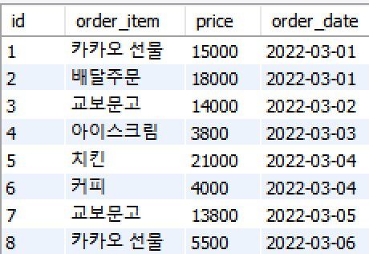
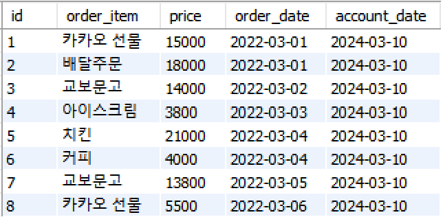
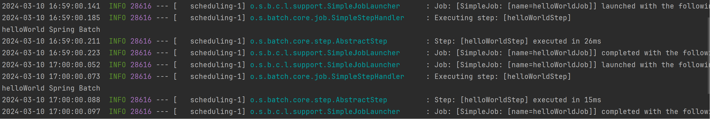

# Chunk 방식의 Job, Step



Orders → Accounts **Migration Job**


```java
@Configuration
@RequiredArgsConstructor
public class TrMigrationJobConfig {

    private final OrdersRepository ordersRepository;
    private final AccountsRepository accountsRepository;

    private final JobBuilderFactory jobBuilderFactory;
    private final StepBuilderFactory stepBuilderFactory;

    @Bean
    public Job trMigrationJob(Step trMigrationStep) {
        return jobBuilderFactory.get("trMigrationJob")
                .incrementer(new RunIdIncrementer())
                .start(trMigrationStep)
                .build();
    }

    @JobScope
    @Bean
    public Step trMigrationStep(ItemReader trOrdersReader, ItemProcessor trOrdersProcessor, ItemWriter trOrdersWriter) {
        return stepBuilderFactory.get("trMigrationStep")
                .<Orders, Accounts>chunk(5) // <어떤 데이터로 읽어와서, 어떤 데이터로 쓸 것인지>.chunk(5개의 데이터를 처리한 후 커밋(= chunk는 트랜잭션의 개수))
                .reader(trOrdersReader)
                .processor(trOrdersProcessor)
                .writer(trOrdersWriter)
                .build();
    }

    @StepScope
    @Bean
    public RepositoryItemWriter<Accounts> trOrdersWriter() {
        return new RepositoryItemWriterBuilder<Accounts>()
                .repository(accountsRepository)
                .methodName("save")
                .build();
    }

    @StepScope
    @Bean
    public ItemProcessor<Orders, Accounts> trOrdersProcessor() {
        return new ItemProcessor<Orders, Accounts>() {
            @Override
            public Accounts process(Orders item) throws Exception {
                return new Accounts(item);
            }
        };
    }

    /*
    Repository, JSON, JDBC 등으로 부터 가져올 수 있음 (read) - 다양한 ItemReader의 형태가 있음
     */
    @StepScope
    @Bean
    public RepositoryItemReader<Orders> trOrdersReader() {
        return new RepositoryItemReaderBuilder<Orders>()
                .name("trOrdersReader")
                .repository(ordersRepository)
                .methodName("findAll")
                .pageSize(5) // 일반적으로 chunk size와 동일
                .arguments(Arrays.asList())
                .sorts(Collections.singletonMap("id", Sort.Direction.ASC))
                .build();
    }
}
```

### 다양한 클래스 지원

ItemReader, ItemProcessor, ItemWriter를 구현한 다양한 클래스가 지원됨

e.g. `RepositoryItemReader`, `MybatisPagingItemReader`, `FlatFileItemReader` 등

### .<Orders, Accounts>chunk(5)

.<Read 대상 데이터 객체, Write 대상 데이터 객체>.chunk(chunk size)

<aside>
💡 chunk size와 paging size는 동일해야 할까?

</aside>

항상 동일해야하는 것은 아니지만, 동일하면 한 페이지를 완전히 읽은 다음 해당 페이지의 모든 아이템을 처리하고 쓸 수 있으므로, 메모리 사용과 트랜잭션 관리가 효율적일 수 있음

### Processor

객체 변환 처리 등 변환, 필터링, 가공 등의 역할

여기서는 Orders → Accounts 객체 변환

---

# Tasklet 방식의 Job, Step

```java
@Configuration
@RequiredArgsConstructor
public class HelloWorldJobConfig {

    private final JobBuilderFactory jobBuilderFactory;
    private final StepBuilderFactory stepBuilderFactory;

    @Bean
    public Job helloWorldJob() {
        return jobBuilderFactory.get("helloWorldJob")
                .incrementer(new RunIdIncrementer())
                .start(helloWorldStep())
                .build();
    }

    @Bean
    public Step helloWorldStep() {
        return stepBuilderFactory.get("helloWorldStep")
                .tasklet(helloWorldTasklet())
                .build();
    }

    @Bean
    public Tasklet helloWorldTasklet() {
        return new Tasklet() {
            @Override
            public RepeatStatus execute(StepContribution stepContribution, ChunkContext chunkContext) throws Exception {
                System.out.println("helloWorld Spring Batch");
                return RepeatStatus.FINISHED;
            }
        };
    }
}
```

---

# JobListener

```java
@Slf4j
public class JobLoggerListener implements JobExecutionListener {

    private static String BEFORE_MESSAGE = "{} Job is Running";
    private static String AFTER_MESSAGE = "{} Job is Done. (Status: {})";

    @Override
    public void beforeJob(JobExecution jobExecution) {
        log.info(BEFORE_MESSAGE, jobExecution.getJobInstance().getJobName());
    }

    @Override
    public void afterJob(JobExecution jobExecution) {
        log.info(AFTER_MESSAGE,
                jobExecution.getJobInstance().getJobName(),
                jobExecution.getStatus());

        if (jobExecution.getStatus() == BatchStatus.FAILED) {
            // email
            log.info("Job is Failed");
        }
    }
}
```

### JobExecution

Job의 실행 상태, 시작 시간, 종료 시간, 성공 여부 등의 정보를 포함 (JobInstance, JobName, JobStatus)

# 스케줄링 (org.springframework.scheduling)

```java
@Component
public class SampleScheduler {

    @Autowired
    private Job helloWorldJob;

    @Autowired
    private JobLauncher jobLauncher;

    @Scheduled(cron = "0 */1 * * * *")
    public void helloWorldJobRun() throws JobInstanceAlreadyCompleteException, JobExecutionAlreadyRunningException, JobParametersInvalidException, JobRestartException {
        JobParameters jobParameters = new JobParameters(
                Collections.singletonMap("requestTime", new JobParameter(System.currentTimeMillis()))
        );

        jobLauncher.run(helloWorldJob, jobParameters);
    }
}
```

### JobLauncher

```java
jobLauncher.run(helloWorldJob, jobParameters);
```

특정 Job을 등록하는 역할

→ `spring.batch.job.enabled=true`라면 JobLauncher로 Job을 직접 등록해주지 않아도 됨

### 결과

