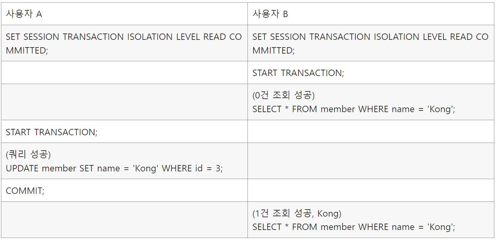
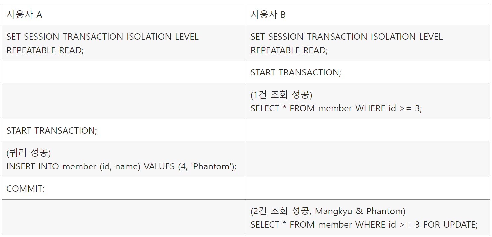
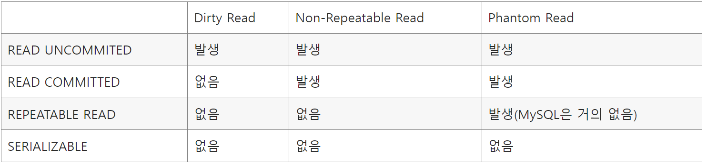

# 0. isolation level (격리 수준)

- 트랜잭션끼리 얼마나 고립되어 있는지를 나타냄
- 여러 트랜잭션이 동시에 실행될 경우, 한 트랜잭션이 다른 트랜잭션에 미치는 영향을 제어하는 메커니즘
- 일반적으로 아래의 네 가지 level이 사용됨

# 1. Read Uncommitted (Level 0)

- 한 트랜잭션이 커밋하지 않은 데이터도 다른 트랜잭션에서 읽을 수 있음 (**Dirty Read**)
    - 즉, 확정되지 않은 데이터를 다른 트랜잭션이 읽어서 사용할 수 있음
- 롤백하는 상황에 문제가 발생할 수 있음

# 2. Read Committed (Level 1)

- 한 트랜잭션이 커밋한 데이터만을 다른 트랜잭션에서 읽을 수 있음
- **Non-repeatable Read** 문제 방지하지 않음

  **`Non-repeatable Read`**

    - 한 트랜잭션 내에서 같은 데이터를 두 번 조회했을 때, 첫 번째 조회와 두 번째 조회의 결과가 다른 현상
    - **데이터 수정(UPDATE)**에 초점
      

- 대부분의 DB 시스템이 기본 채택하는 방식 (Oracle 등)
- ~~예) 상품 가격 변경~~

# 3. Repeatable Read (Level 2)

- 한 트랜잭션 내에서 **읽은** 데이터는 해당 트랜잭션이 종료될 때까지 동일하게 유지됨
- **Phantom Read** 방지하지 않음

  `Phantom Read`

    - 한 트랜잭션 내에서 동일한 쿼리를 여러 번 실행했을 때, 새로 삽입되거나 삭제된 행으로 인해 결과가 달라지는 현상
    - **데이터 추가/삭제(INSERT/DELETE)**에 초점
      

- MySQL 등에서 기본으로 채택

# 4. Serializable (Level 3)

- 가장 높은 격리 수준
- 트랜잭션이 순차적으로 실행되는 것처럼 보장
    - 여러 트랜잭션이 동일한 레코드에 동시 접근할 수 없음 (Shared Lock)
- 모든 읽기 이상 현상 방지
- 동시성이 크게 제한될 수 있음

# 5. 정리

- 더 높은 격리 수준은 더 많은 **데이터 일관성**을 보장하지만

  동시에 수행할 수 있는 트랜잭션의 수가 줄어들어, **시스템 성능이 감소**할 수 있음

### 참고자료

- https://mangkyu.tistory.com/299
- https://mangkyu.tistory.com/300
- https://akasai.space/db/about_isolation/