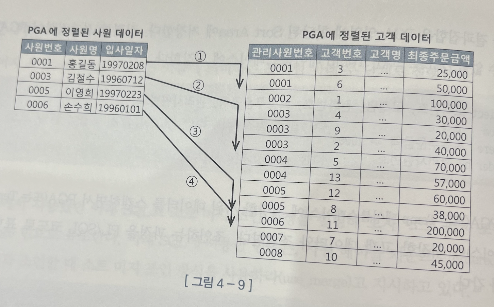
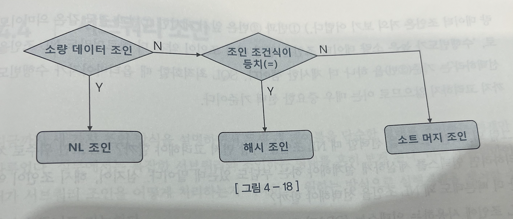

# NL 조인

인덱스를 이용한 조인 방식 (소트 머지 조인과 해시 조인은 조인 과정에서 인덱스를 이용하지 않음)

### 특징

- 내부적으로 다중 for문처럼 실행됨
    - cf. Outer, Inner
    - 한 레코드씩 순차적으로 진행
- 인덱스를 사용하기 때문에 주로 **랜덤 액세스** 발생
    - 대량 데이터 조인 시 비효율 발생
    - (다른 조인에 비해) 인덱스 구성 전략에 따라 성능 차이가 큼
- use_nl() 힌트

    ```sql
    SELECT /*+ leading(C, A, D, B) use_nl(A) use_nl(D) use_hash(B) */
    	*
    FROM A, B, C, D
    WHERE ...
    ```


### 튜닝

- **인덱스 튜닝**에 해당하는 기법 적용
- Outer row 수 < Inner row 수
- 대량 데이터 조인할 때 성능이 매우 느림 → **소트 머지 조인**, **해시 조인** 개발됨

# 소트 머지 조인

각각의 테이블을 Sort한 후 그 결과를 Merge하는 조인 방식

### 특징

- Outer 데이터 기준으로 Inner 데이터를 매번 Full Scan하지 않아도 됨

  
  → 고객 데이터가 정렬돼 있으므로 조인 대상 레코드가 시작되는 지점을 쉽게 찾을 수 있고, 조인에 실패하는 레코드를 만나는 순간 바로 멈출 수 있음

- use_merge() 힌트

    ```sql
    SELECT /* ordered use_merge(c) */
    	...
    FROM 사원 e, 고객 c
    WHERE c.관리자사원번호 = e.사원번호
    AND e.입사일자 >= '19960101'
    AND e.부서코드 >= 'Z123'
    AND c.최종주문금액 >= 20000
    ```


<aside>
💡 **소트 머지 조인이 NL 조인보다 빠른 이유**

</aside>

NL 조인은 읽는 모든 블록에 래치 획득 및 캐시버퍼 체인 스캔 과정을 거침. **(버퍼 캐시 경유 과정)**

데이터를 건건이 읽어오는 NL조인과 다르게 소트 머지 조인은 조인 대상 집합을 ‘일괄적으로’ (cf. 배치) 읽어 PGA(Process Global Area)에 저장함.

PGA는 별도의 래치 획득 과정이 없기 때문에 SGA(System Global Area)로의 접근이 많은 NL 조인보다 빠름 (대량 데이터 조인에 유리함)

```markdown
# cf. SGA와 PGA 비교
SGA(System Global Area)
	- 여러 프로세스가 공유하여 사용
	- 동시 사용을 막기 위해 래치라는 방식으로 락을 걺

PGA(Process Global Area)
	- 프로세스의 고유 데이터 저장
	- 락이 필요하지 않아 속도가 빠름
```

### 선택 기준

- 조건식이 등치 조건이 아닌 대량 데이터 조인인가
    - 해시 조인이 소트 머지 조인보다 대부분 빠르지만, 해시 조인은 **등치 조건**이 아니면 사용할 수 없음. 이 때 소트 머지 조인을 사용하는 것이 좋음.
- 조인 조건식이 없는 Cross join

# 해시 조인

조인 컬럼을 Key로 하는 해시 맵을 만들어 조인

### 특징

- Build 단계 → Probe 단계를 거쳐서 조인
    1. **Build 단계**: 해시 함수를 통해 해시 테이블(해시 맵)을 만듦
    2. **Probe 단계**: 해시 함수가 반환한 해시 값에 대한 해시 체인만 탐색

- use_hash() 힌트

    ```sql
    SELECT /* ordered use_hash(c) */
    	...
    FROM 사원 e, 고객 c
    WHERE c.관리자사원번호 = e.사원번호
    AND e.입사일자 >= '19960101'
    AND e.부서코드 >= 'Z123'
    AND c.최종주문금액 >= 20000
    ```


<aside>
💡 **해시 조인이 소트 머지 조인보다 빠른 이유**

</aside>

- 두 개의 테이블을 모두 PGA에 저장해야 하는 소트 머지 조인과 다르게 해시 조인은 하나의 테이블만 저장하면 됨
- 소트 머지 조인의 정렬 비용이 해시 조인에는 없음

### 선택 기준

해시 테이블은 단 하나의 쿼리를 위해 생성하고 조인이 끝나면 곧바로 소멸하는 자료구조기 때문에

수행시간이 짧으면서 수행빈도가 매우 높은 쿼리(e.g. OLTP)를 해시 조인으로 처리하면 CPU 메모리 사용률이 크게 증가하고 해시 맵을 만드는 과정에 여러 가지 래치 경합도 발생한다는 문제가 있음.

1. **수행 빈도가 낮고**
2. **쿼리 수행 시간이 오래 걸리는**
3. **대량 데이터 조인할 때**

사용하는 것이 좋음. 결국 이 특징은 배치 프로그램의 특징이라고 할 수도 있음.

