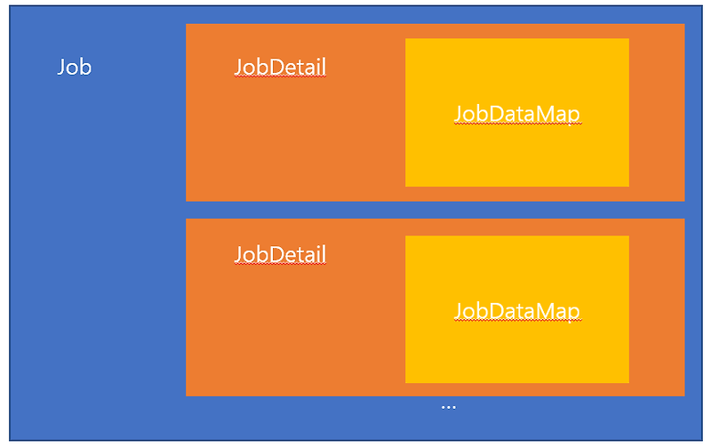

# Quartz란?

Java 애플리케이션에서 작업(Job) 스케줄링을 관리하기 위해 사용되는 오픈소스 라이브러리

# 주요 개념

### Scheduler

- 작업(Job)과 Trigger를 관리하고 실행하는 역할
- 해당 인스턴스에 작업(Job)을 등록, 수정, 삭제 가능

### Job

- 수행할 작업을 정의할 인터페이스
- `execute(JobExecutionContext context)` 메서드를 통해 작업 구현

### JobDetail

- Job 인스턴스와 관련된 데이터를 캡슐화하는 클래스
- JobDataMap, JobKey 등의 정보를 포함



### Trigger

- 실행될 시점을 정의하는 컴포넌트
- SimpleTrigger, CronTrigger 등 다양한 Trigger 제공

### JobStore

- 스케줄된 Job, Trigger 정보 저장소
- 메모리 기반 저장소, 데이터베이스 기반 저장소(QRTZ_JOB_DETAILS 등) 모두 제공

```java
import org.quartz.Job;
import org.quartz.JobExecutionContext;
import org.quartz.JobExecutionException;

public class TestJob implements Job {
    @Override
    public void execute(JobExecutionContext context) throws JobExecutionException {
        System.out.println("Quartz Test");
    }
}
```

```java

import org.quartz.*;
import org.quartz.impl.StdSchedulerFactory;

public class QuartzExample {
    public static void main(String[] args) {
        try {
            // 스케줄러 생성
            Scheduler scheduler = StdSchedulerFactory.getDefaultScheduler();
            
            // JobDetail 생성
            JobDetail job = JobBuilder.newJob(TestJob.class)
                    .withIdentity("myJob", "group1")
                    .build();
            
            // Trigger 생성 (5초마다 실행)
            Trigger trigger = TriggerBuilder.newTrigger()
                    .withIdentity("myTrigger", "group1")
                    .startNow()
                    .withSchedule(SimpleScheduleBuilder.simpleSchedule()
                            .withIntervalInSeconds(5)
                            .repeatForever())
                    .build();
            
            // 스케줄러에 Job과 Trigger 등록
            scheduler.scheduleJob(job, trigger);
            
            // 스케줄러 시작
            scheduler.start();
            
        } catch (SchedulerException | InterruptedException se) {
            se.printStackTrace();
        }
    }
}
```

# 주요 기능

### 스케줄링

다양한 Trigger를 통해 복잡한 스케줄링 가능 (Cron 표현식)

### Misfire 처리

(시스템 부하, 애플리케이션 중단, 네트워크 문제 등의 이유로) 지정된 시간에 작업이 실행되지 못했을 경우, Misfire 정책을 통해 이러한 작업을 처리할 수 있음

```java
Trigger cronTrigger = TriggerBuilder.newTrigger()
        .withIdentity("cronTrigger", "group1")
        .withSchedule(CronScheduleBuilder.cronSchedule("0/5 * * * * ?")
                .withMisfireHandlingInstructionFireAndProceed())
        .build();
```

### Listener 제공

- Job과 Trigger 모두 Listener 제공
- Job과 Trigger 시작 전후 이벤트 설정 가능