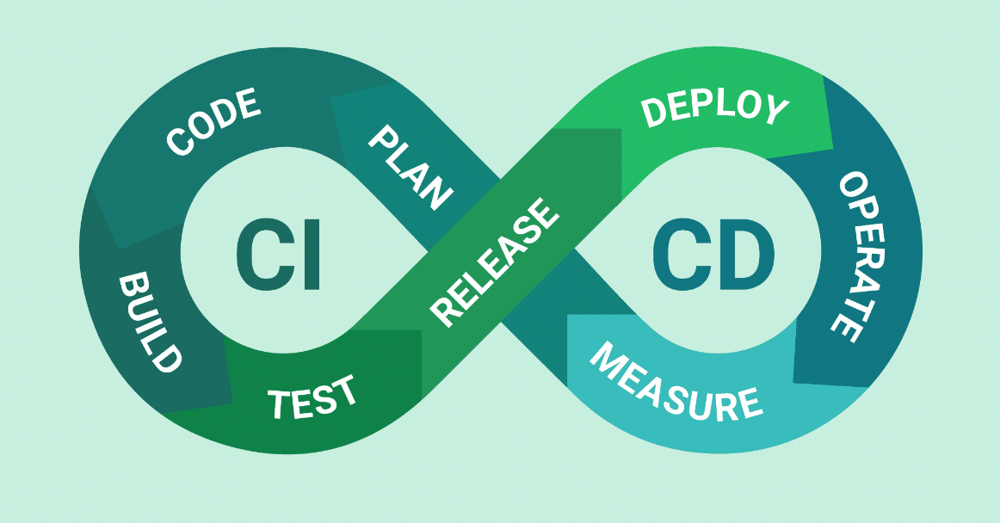

# 1. CI/CD란?

애플리케이션 개발 단계를 **자동화**하여, 애플리케이션을 더욱 **짧은 주기**로 고객에게 제공하는 방법

2000년대 초 Agile 개발 방법론(빠른 소프트웨어 개발과 빈번한 배포 강조)과 함께 등장

Jenkins, CircleCI, Bamboo 등의 Tool이 있음

## CI

- Continuous Integration = 지속적 통합
    - integration: 소스 코드 병합 (merge)
    - 즉, 코드 변경 사항을 주기적으로 중앙 저장소에 통합하는 관행을 뜻함
- 소스 코드 병합할 때 발생할 수 있는 충돌의 해결 시간을 줄이고자 함
- **빌드 및 테스트 자동화**

## CD - Delivery

- Continuous Delivery = 지속적 제공
- 코드 변경 사항이 자동으로 테스트되고, 프로덕션 환경에 **배포될 준비가 되어 있는 상태**로 유지하는 것
- 빌드, 테스트, 배포 준비 과정은 모두 자동화. but, 실제 프로덕션 환경으로의 배포는 **수동**

## CD - Deployment

- Continuous Deployment = 지속적 배포
    - Delivery의 다음 단계
- 코드 변경 사항이 **자동**으로 프로덕션 환경에 배포되는 과정
- 개발자가 소스 코드를 변경하면, 이 변경 사항은 자동으로 빌드, 테스트되고, 통과되면 바로 프로덕션 환경에 배포됨

### C-Delivery와 C-Deployment**의 차이점**

**배포 과정의 자동화 유무**

- C-Delivery: 배포 준비 과정까지만 자동화
- C-Deployment: 최종 배포까지 모두 자동화

**cf. 프로덕션 환경의 배포 준비 (CI와 C-Delivery의 차이점)**

: 스테이징 환경에서의 테스트, 구성 관리, 데이터베이스 마이그레이션, 서버 환경 설정, 보안 검토 등

# 2. CI/CD의 장점

### 효율성 및 속도 향상

- **빠른 피드백**: CI/CD를 통해 개발자는 코드 변경 사항을 빠르게 통합하고, 자동화된 테스트를 통해 즉각적인 피드백을 받을 수 있음
- **생산성 증가**: 자동화된 프로세스는 반복적인 작업을 줄여 개발자의 개발 생산성을 높임

### 품질 보증

- **코드 품질 향상**: 지속적인 테스팅과 통합은 코드의 품질을 일정하게 유지하도록 돕고, 버그와 오류는 초기 단계에서 발견되어 수정할 수 있음
- **안정적인 배포**: CD를 통해 배포 프로세스가 자동화되면, 프로덕션 환경으로의 안정적인 배포를 보장함

# 3. +@

## 블루/그린 배포

두 개의 동일한 환경을 사용하여 새 버전으로의 전환을 용이하게 하는 무중단 배포 기법 중 하나

→ 블루(현재 운영 중인 상태)와 그린(새 버전을 배포할 준비가 된 상태)

- ‘블루 → **블루, 그린 둘 모두 트래픽 처리** → 그린'의 과정을 거침

### 장점

- 사용자에게 영향을 주지 않고 새 버전을 배포할 수 있음 (무중단 배포)
- 새 버전에 문제가 있을 경우, 이전 버전으로의 롤백이 매우 빠르고 간단함

**참고자료**

- [https://jud00.tistory.com/entry/CICD란-무엇일까](https://jud00.tistory.com/entry/CICD%EB%9E%80-%EB%AC%B4%EC%97%87%EC%9D%BC%EA%B9%8C)
- https://www.redhat.com/ko/topics/devops/what-is-ci-cd
- [https://velog.io/@mjhuh263/기술면접준비-Integration-Testing-Unit-Testing-CICD](https://velog.io/@mjhuh263/%EA%B8%B0%EC%88%A0%EB%A9%B4%EC%A0%91%EC%A4%80%EB%B9%84-Integration-Testing-Unit-Testing-CICD)