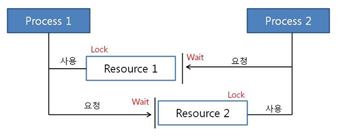

## 1. 데드락(=교착상태)이란?

**둘 이상의 프로세스가 다른 프로세스가 점유하고 있는 자원을 서로 기다릴 때 무한 대기에 빠지는 상황**

cf. 싱글스레드에서 비동기 처리를 하면 데드락과 비슷한 프로그램 무한 대기 상태에 빠질 수는 있음 (종속성이 있는 경우, 서로의 작업 완료를 대기하는 상황). 하지만 `데드락`이라는 것이 `둘 이상의 프로세스`를 가정하기 때문에 전통적인 데드락이라고는 할 수 없음.

## **2. 데드락 발생의 네 가지 필수 조건**

1. **상호 배제**

   : 한 번에 하나의 프로세스만 자원을 사용할 수 있음

2. **점유 & 대기**

   : 프로세스가 최소한 하나의 자원을 보유한 상태에서, 다른 프로세스가 사용중인 추가 자원을 기다림

3. **비선점**

   : 프로세스가 이미 자원을 할당받았으면, 그 자원을 강제로 빼앗을 수 없음

4. **순환 대기**

   : 대기 프로세스의 집합이 순환 형태로 자원을 대기하고 있어야 함

   `P1 → P2 → … → Pn → P1` 이처럼 대기 사슬이 형성되어야 함

## 3. 데드락 해결 방법

1. **예방**

   : 데드락의 네 가지 필수 조건 중 적어도 하나를 깨뜨려 데드락이 발생하지 않도록 하는 방식

    - 상호 배제 부정: 가능하면 자원을 공유하도록 함
    - 점유 & 대기 부정: 프로세스가 실행되기 전에 모든 자원을 한 번에 요청하도록 함. 프로세스가 실행 중에 추가 자원을 요청하지 못하게 하는 방식
    - 비선점 부정: 프로세스가 요청하는 자원이 다른 프로세스에 의해 이미 보유 중이라면, 초기 프로세스는 자신의 모든 자원을 방출하고, 필요한 자원을 다시 요청해야 함
    - 순환 대기 부정: 모든 자원에 고유한 숫자를 할당하여, 프로세스가 반드시 증가하는 순서로만 자원을 요청하게 함
2. **회피**

   : 시스템이 데드락 가능성을 허용하지만, 특정 알고리즘을 사용하여 데드락이 발생할 가능성이 있는 자원 할당을 피하는 방식

    - 뱅커스 알고리즘: 각 프로세스에 최대 자원 요구량을 미리 선언하게 하고, 시스템이 안전 상태(Safe State)에 있을 때만 자원을 할당하는 알고리즘
3. **탐지 및 복구**

   : 시스템이 데드락을 허용하되, 데드락 발생을 탐지하고 복구하기 위한 메커니즘을 구현하는 방식

    - 탐지: 시스템은 주기적으로 또는 특정 이벤트가 발생했을 때 자원 할당 그래프를 검사하여 데드락의 존재를 탐지함
    - 복구: 데드락이 탐지되면, 시스템은 하나 이상의 프로세스를 종료하거나 할당된 자원을 선점하여 데드락을 해결함
4. **무시**

   : 말 그대로 데드락 문제를 무시하는 방식

   데드락이 자주 발생하지 않거나, 데드락을 처리하는 비용이 높을 때 사용하는 방식

   데드락이 발생할 경우 사용자가 수동으로 해결하도록 하며, 실제로 많은 운영체제가 사용하는 전략임.