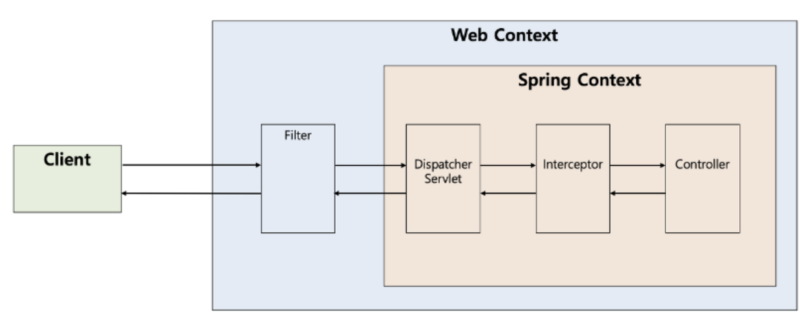

# 1. Filter

## 1.1. Filter란?

Java **Servlet** API의 일부로, 클라이언트의 요청과 서버의 응답 사이에서 사전 및 사후 처리를 수행하는 재사용 가능한 코드

=> 즉, 중복 코드를 제거하기 위한 목적

## 1.2. 사용법

## 1.2.1. 기본 메소드

```java
public interface Filter {

    public default void init(FilterConfig filterConfig) throws ServletException {}

    public void doFilter(ServletRequest request, ServletResponse response,
            FilterChain chain) throws IOException, ServletException;

    public default void destroy() {}
    
}
```

implements **Filter**

- **init(**FilterConfig**)**
  - 필터 인스턴스가 생성된 후 초기화 목적으로 호출되는 메소드
  - 단 한 번만 호출되며, 필터가 요청을 처리하기 전에 필요한 자원을 할당하거나 설정 정보를 읽는 등의 초기화 작업을 수행하는 데 사용
  - 이후의 요청들은 doFilter()를 통해 처리됨
- **doFilter(**ServletRequest, ServletResponse, FilterChain**)**
  - 필터가 수행해야 할 실제 작업 메소드
  - **로깅, 인증 및 권한 검사, 요청 및 응답에 대한 변형** 등의 역할 수행
  - **`ServletRequest`**와 **`ServletResponse`** 객체를 컨트롤 할 수 있음
- **destroy()**
  - 필터 인스턴스가 서비스에서 제거될 때 호출되는 메소드
  - 단 한 번만 호출되며, 필터가 사용한 자원을 정리하고 해제하는 데 사용

## 1.2.2. Config

- Filter Class에 **@Component**
  - URL 등록 불가능
- Filter Class에 **@WebFilter**(urlPatterns = "/blah/blah") + **@ServletComponentScan**
  - URL 등록은 되지만, 순서 지정 불가능 (@Order(1))
- **FilterRegistrationBean** @Bean 등록
  - URL 등록도 되고, 순서 지정도 가능하므로 이 방법을 가장 권장

```java
@Configuration
public class FilterConfig {

    @Bean
    public FilterRegistrationBean<CustomFilter> customFilterRegistration() {
        FilterRegistrationBean<CustomFilter> registrationBean = new FilterRegistrationBean<>();
        registrationBean.setFilter(new CustomFilter());

        // URL 패턴 설정
        registrationBean.addUrlPatterns("/api/*");
 
        // 필터 실행 순서         
        registrationBean.setOrder(1);

        return registrationBean;
    }
}
```

# 2. Interceptor

## 2.1. Interceptor란?

Dispatcher Servlet이 Controller를 호출하기 전과 후에 HTTP 요청과 응답을 가로 채 참조, 가공 등의 처리를 하는 **Spring** 컴포넌트

## 2.2. 사용법

## 2.2.1. 기본 메소드

```java
public interface HandlerInterceptor {

    default boolean preHandle(HttpServletRequest request, HttpServletResponse response, Object handler)
        throws Exception {
        
        return true;
    }

    default void postHandle(HttpServletRequest request, HttpServletResponse response, Object handler,
        @Nullable ModelAndView modelAndView) throws Exception {
    }

    default void afterCompletion(HttpServletRequest request, HttpServletResponse response, Object handler,
        @Nullable Exception ex) throws Exception {
    }
}
```

implements **HandlerInterceptor**

- **preHandle(**HttpServletRequest, HttpServletResponse, Object**)**
  - 컨트롤러가 호출되기 전에 실행되는 메소드
  - 사용자 인증 체크 등에 사용
- return boolean
  - return true; 다음 Interceptor 혹은 대상 Controller로 이동
  - return false; 요청 처리 중단. 일반적으로 클라이언트에 에러 코드를 반환하도록 구현
- **postHandle(**HttpServletRequest, HttpServletResponse, Object, ModelAndView**)**
- 컨트롤러가 호출된 후에 실행되는 메소드
  - DispatchServlet이 View를 렌더링하기 전에 호출됨
  - Controller가 반환한 `ModelAndView`객체에 추가 데이터를 설정하거나, 특정 조건에 따라 View를 변경할 때 사용
  - Controller 하위 계층에서 작업을 진행하다가 중간에 예외가 발생하면 postHandle()는 호출되지 않음
- **afterCompletion(**HttpServletRequest, HttpServletResponse, Object, Exception**)**
  - 전체 요청 처리가 완료된 후(= View 렌더링이 포함된 모든 작업이 끝난 후) 호출
  - 자원을 정리하거나, 요청 처리 중에 발생한 예외를 로깅하는 데 사용
  - 요청 처리 과정 중에 예외가 발생해도 실행됨 (Exception 파라미터를 통해 발생한 예외 확인 가능)

cf. HandlerInterceptorAdapter (Spring5.3 deprecated; abstract class)

Java 8 HandlerInterceptor interface는 필요한 메소드만 구현해도 되게 변경됨

## 2.2.2. Config

```java
@Configuration
public class WebMvcConfig implements WebMvcConfigurer {

    @Override
    public void addInterceptors(InterceptorRegistry registry) {
        // LoggingInterceptor 등록
        registry.addInterceptor(new LoggingInterceptor())
                .addPathPatterns("/api/**") // 이 인터셉터가 적용될 URL 패턴
                .excludePathPatterns("/api/public/**") // 이 패턴은 제외                
                .order(1); // 실행 순서

        registry.addInterceptor(new AuthenticationInterceptor())
                .addPathPatterns("/api/secure/**") 
                .order(2); 
    }
}
```